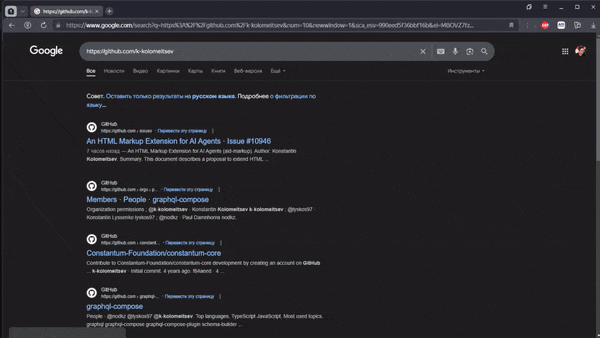

# Chrome browser extension that adds aid-markup (HTML Markup for AI Agents)

The extension is designed for automatically adding aid-markup (HTML Markup for AI Agents) to the HTML structure of websites

You can read more about aid-markup here: [aid-markup](https://github.com/k-kolomeitsev/aid-markup)

Markup configurations are stored in the extension's settings

Markup configurations can also be loaded from the [aid-markup repository](https://github.com/k-kolomeitsev/aid-markup/tree/main/markups)

You can add your own configurations by preparing the necessary JSON data package in the following format:

```json
{
  "site": "google.com",
  "pages": [
    {
      "page": "/",
      "selectors": {
        "#searchform": "aid-type=\"header\"",
        "#APjFqb": "aid-type=\"interactive\" aid-desc=\"Input for search query\"",
        ".HZVG1b.Tg7LZd": "aid-type=\"interactive\" aid-desc=\"Start search button\""
      }
    },
    {
      "page": "/search",
      "selectors": {
        "#searchform": "aid-type=\"header\"",
        "#APjFqb": "aid-type=\"interactive\" aid-desc=\"Input for search query\"",
        ".HZVG1b.Tg7LZd": "aid-type=\"interactive\" aid-desc=\"Start search button\"",
        "#rso": "aid-type=\"content\" aid-desc=\"Search results section\"",
        ".crJ18e": "aid-type=\"nav\" aid-desc=\"Switching search modes\"",
        ".nPDzT:not(.T3FoJb)": "aid-type=\"interactive\" aid-desc=\"Selecting a search mode\" aid-state=\"done\"",
        ".nPDzT.T3FoJb": "aid-type=\"interactive\" aid-desc=\"Selecting a search mode\" aid-state=\"idle\"",
        ".N54PNb.BToiNc": "aid-cnt-type=\"info\" aid-cnt-kind=\"desc\"",
        ".N54PNb.BToiNc .yuRUbf a:not(.fl)": "aid-type=\"interactive\" aid-desc=\"Follow the link\"",
        ".AaVjTc": "aid-type=\"nav\" aid-desc=\"Pagination\"",
        ".AaVjTc a": "aid-type=\"interactive\" aid-desc=\"Go to another page\""
      }
    }
  ]
}
```

The extension features a browser icon, which allows you to enable or disable the visualization of the markup (Right-click the icon and select "Show markup" or "Hide markup")

## How it looks


